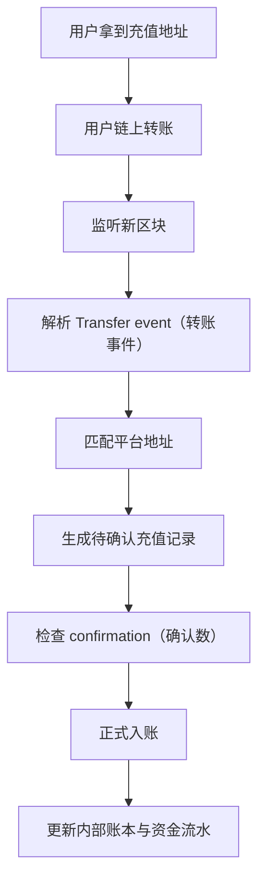

# Deposit Flow

```mermaid
flowchart TD
    A["用户拿到充值地址"] --> B["用户链上转账"]
    B --> C["监听新区块"]
    C --> D["解析 Transfer event（转账事件）"]
    D --> E["匹配平台地址"]
    E --> F["生成待确认充值记录"]
    F --> G["检查 confirmation（确认数）"]
    G --> H["正式入账"]
    H --> I["更新内部账本与资金流水"]
```

