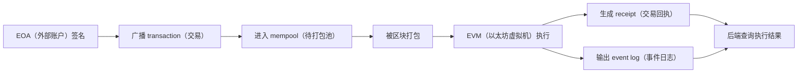

# Transaction Lifecycle

```mermaid
flowchart LR
    A["EOA（外部账户）签名"] --> B["广播 transaction（交易）"]
    B --> C["进入 mempool（待打包池）"]
    C --> D["被区块打包"]
    D --> E["EVM（以太坊虚拟机）执行"]
    E --> F["生成 receipt（交易回执）"]
    E --> G["输出 event log（事件日志）"]
    F --> H["后端查询执行结果"]
    G --> H
```

