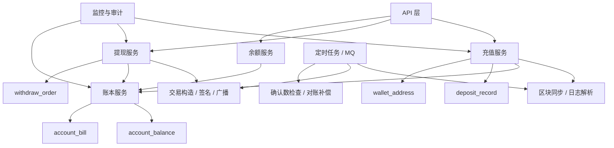

# Wallet Backend Architecture

```mermaid
flowchart TB
    A["API 层"] --> B["充值服务"]
    A --> C["提现服务"]
    A --> D["余额服务"]

    B --> E["区块同步 / 日志解析"]
    C --> F["交易构造 / 签名 / 广播"]

    B --> G["账本服务"]
    C --> G
    D --> G

    G --> H["account_balance"]
    G --> I["account_bill"]
    B --> J["deposit_record"]
    C --> K["withdraw_order"]
    B --> L["wallet_address"]

    M["定时任务 / MQ"] --> E
    M --> F
    M --> N["确认数检查 / 对账补偿"]

    O["监控与审计"] --> B
    O --> C
    O --> G
```

