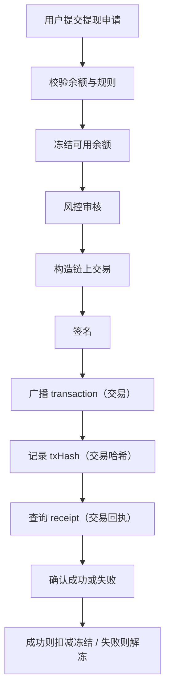

# Withdraw Flow

```mermaid
flowchart TD
    A["用户提交提现申请"] --> B["校验余额与规则"]
    B --> C["冻结可用余额"]
    C --> D["风控审核"]
    D --> E["构造链上交易"]
    E --> F["签名"]
    F --> G["广播 transaction（交易）"]
    G --> H["记录 txHash（交易哈希）"]
    H --> I["查询 receipt（交易回执）"]
    I --> J["确认成功或失败"]
    J --> K["成功则扣减冻结 / 失败则解冻"]
```

